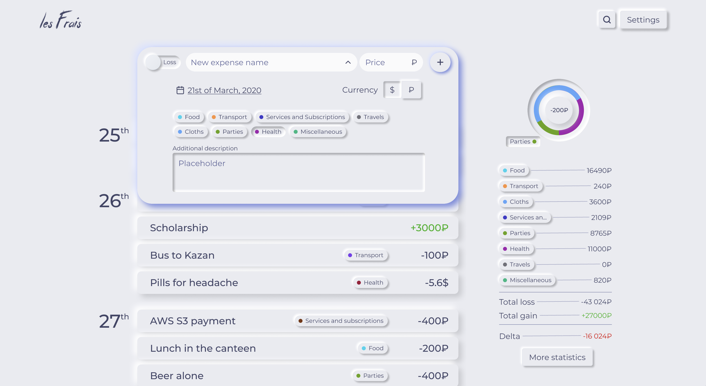
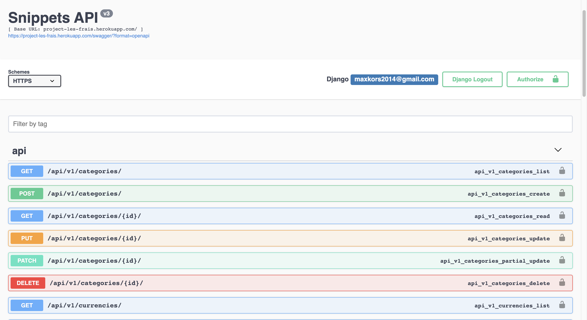
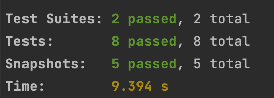
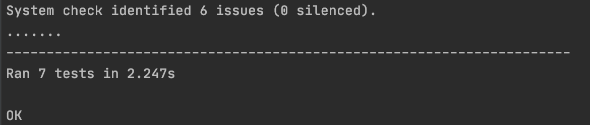
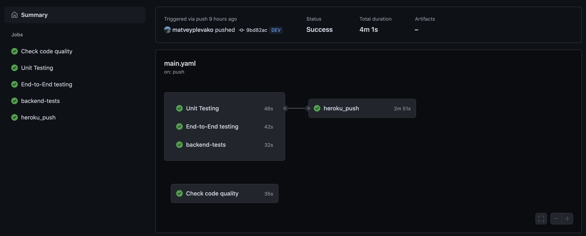

# IU MAP-S21 project Les Frais

## Project objective

The purpose of this project is to develop a web application, an 
expense tracker called «Les Frais» (hereinafter referred to as the
Service) for the general use of people on the Internet.

Main objectives of the Service are the control and accounting
of incomes and expenses, view statistics on all transactions in any
language and currency.

Useful links:
* [Project backlog](https://github.com/IU-MAP/project-les-frais/projects/1)
* [Application deployed to Heroku](https://project-les-frais.herokuapp.com) (might require ~10-30s to warm up)
* [Figma designs](https://www.figma.com/file/qP2zLO26bEDAWH35ssGUjB/Les-Frais)
* [Swagger documentation](https://project-les-frais.herokuapp.com/swagger/)
* [E2E test videos](https://drive.google.com/drive/folders/1rxUNc_9MaX99J5Va_ujMm0L9ZTkovlXY?usp=sharing)

## Initial product backlog

### User Stories

The backlog consists of the User Stories written to show
the main functionality of the Services. They are all kept
in the [GitHub issues](https://github.com/IU-MAP/project-les-frais/issues?q=is%3Aissue+is%3Aopen+label%3A%22User+Story%22):

* [Authorization and registration](https://github.com/IU-MAP/project-les-frais/issues/8)
* [Transactions](https://github.com/IU-MAP/project-les-frais/issues/17)
* [Data import](https://github.com/IU-MAP/project-les-frais/issues/12)
* [Categories](https://github.com/IU-MAP/project-les-frais/issues/18)
* [Switch default currency](https://github.com/IU-MAP/project-les-frais/issues/25)
* [Expense templates](https://github.com/IU-MAP/project-les-frais/issues/29)
* [Interface language switch](https://github.com/IU-MAP/project-les-frais/issues/22)
* [Search transactions](https://github.com/IU-MAP/project-les-frais/issues/34)
* [Statistics](https://github.com/IU-MAP/project-les-frais/issues/39)

## Development

### Teamwork

The following team is working on a project:
* [Maxim Korsunov](https://github.com/VanishMax) – Frontend developer, UI/UX designer
* [Alexander Krivonosov](https://github.com/GneyHabub) – Frontend developer
* [Matvey Plevako](https://github.com/matveyplevako) – Backend developer
* [Andrey Feygelman](https://github.com/Andrey862) – Backend developer

As a team, we use SCRUM framework for flexible development. The project
repo uses Git Flow methodology to fix the main branch only for
production releases, and keep the main work in the DEV branch.

Merges into the DEV and Master should be possible only after the Pull
Request is created and passed all CI and CD checks, and the code is
reviewed by the members of the SCRUM team.

### Technical requirements


**Server-side requirements**:
* Backend has to be implemented in the latest version of Python language.
* Backend has to use Django framework.
* Database has to be PostgreSQL.
* All calculations performed by the server-side must be 
  accurate and tested using unit and integration tests.



**Web-app requirements**:
* Web application has to be implemented in the Vue 3 framework of JavaScript language, SPA mode.
* The quality has to be assured by unit component testing and with end-to-end tests of the whole Service.
* Application must support accessible UI and UX across all mobile and desktop devices.
* Application must be performant in terms of time and memory, do not utilize heavy memory resources and load in less than a second showing 90% of Lighthouse audit test passing.

All the designs are kept in the Figma project: https://www.figma.com/file/qP2zLO26bEDAWH35ssGUjB/Les-Frais


## Project setup

### File structure

The file structure, if looking from the root directory, is the following:
* `.github` – workflows for testing and automation
* `backend` – Python backend application
* `src` – Frontend application
* `readme` – sources for the grading data
* other configuration files – needed for the proper deployment. Putting them not in the root folder causes many problems. 

### Backend setup
Firstly, create virtual environment in backend directory (code for windows):
```bash
python -m venv venv
venv\Scripts\activate
```

Then, run:
```bash
pip install -r requirements.txt
python manage.py migrate
python manage.py runserver
```

If you want to access admin panel you need to create superuser (it will ask you to enter username and password from console)
```bash
python manage.py createsuperuser
```

| Backend Endpoints:| |
|---|---|
|/swagger | swagger endpoint documentation|
|/admin | admin panel |
|/api/v1/transactions| |
|/api/v1/currencies| |
|/api/v1/categories| |
| | |


### Frontend installation

To start working with this, firstly install all dependencies. It is required to
have Node.js v12 and greater to be installed on your machine.

```bash
npm ci
```

And now, you can **run the app in development mode**:
```bash
npm run dev
```

**Linting** can be done by this command:
```bash
npm run lint
```

**Tests** (either unit or end-to-end) are performed by this command:
```bash
npm run test:unit
npm run test:e2e
```

## Progress

This is a descriptions of the project results by each weekly
sprints with links to the values, documentations and tests produced
throughout the work.

### Sprint 0

Established the description of the project, its goals and purposes.
Formulated 9 main User Stories each of which adds value to the
resulting web application. Arranged the product backlog with
assigned tasks to 7 planned sprints and wrote the Readme of the
project summarizing previous statements.

### Sprint 1

During this sprint, the whole team focused on the only one User Story:
user authorization. Since the project was only started, we produced
the following results:
* Set up the frontend application with Vue 3 framework
* Set up the backend application with Django
* Implemented authorization endpoints on the backend
* Connected the frontend with [Figma designs](https://www.figma.com/file/qP2zLO26bEDAWH35ssGUjB/Les-Frais) and backend
* Set up GitHub Actions workflows for checking frontend quality
* Deploy [the application](https://project-les-frais.herokuapp.com) to Heroku


### Sprint 2

The goal of this sprint was the implementation of transaction 
creation User Story. During this spring, we:

* Produced backend documentation in form of [Swagger](https://project-les-frais.herokuapp.com/swagger/)
* Implemented CRUD endpoints for different entities: Transactions, Categories, Currencies etc.
* Connected frontend with the backend endpoints for transaction creation
* Implemented category creation in the settings page of the app
* Tested frontend basic components with unit tests
* Tested backend authorization and transaction creation





After two weeks of development, it is already possible to interact 
with application's basic functionality.

### Sprint 3

The sprint was focused on the finishing the technical dept, adding only small features aimed to improve
user experience and reduce the unexpected behavior or the amount of bugs users can encounter. We:

* Implemented transaction edition, selection and batch removal #15
* Implemented category editing and removal
* Fixed bugs all around the website after manual hand testing 
* Fixed link to the [Swagger](https://project-les-frais.herokuapp.com/swagger/) documentation 
* Added E2E tests for #5 #16 #21 #24. Cypress has produced test videos that [can be found here](https://drive.google.com/drive/folders/1rxUNc_9MaX99J5Va_ujMm0L9ZTkovlXY?usp=sharing)
* Added more unit tests for frontend components
* Started working on the big user story of data import from .XLS files

After this sprint, such user stories are completed fully:

* [Authorization and registration](https://github.com/IU-MAP/project-les-frais/issues/8)
* [Transactions](https://github.com/IU-MAP/project-les-frais/issues/17)
* [Categories](https://github.com/IU-MAP/project-les-frais/issues/18)
* [Interface language switch](https://github.com/IU-MAP/project-les-frais/issues/22)

### Sprint 4

It was a heavy-loaded week, but we succeeded in several User Stories:
* Finished [Expense templates](https://github.com/IU-MAP/project-les-frais/issues/29) User Story
* Created [User documentation page](http://project-les-frais.herokuapp.com/help) on the website that explains how to interact with the application
* Heavily documented code in JSDoc format. [Here's the example](https://github.com/IU-MAP/project-les-frais/blob/master/src/utils/api/auth.ts)
* Continued working on Data Import feature. Made an endpoint that accepts and .XLS file, parses it and returns JSON to the frontend
* Implemented Continuous Integration of backend tests
* Implemented [Continuous Delivery to Heroku](https://github.com/IU-MAP/project-les-frais/actions/runs/811295225) via GitHub actions

So, we mainly improved the value of the project by documenting it more, refining our goals and improving 
User Experience via expense templates. Also, we improved Developer Experience through better CI/CD.


