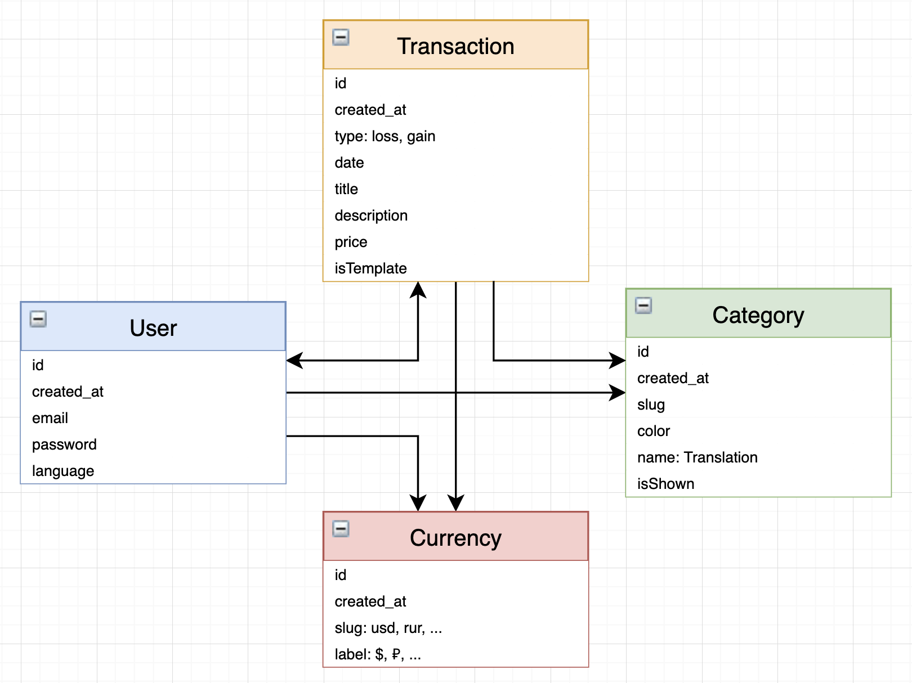

# IU MAP-S21 project Les Frais

## Project objective

The purpose of this project is to develop a web application, an 
expense tracker called «Les Frais» (hereinafter referred to as the
Service) for the general use of people on the Internet.

Main objectives of the Service are the control and accounting
of incomes and expenses, view statistics on all transactions in any
language and currency.

## Initial product backlog

### User Stories

The backlog consists of the User Stories written to show
the main functionality of the Services. They are all kept
in the [GitHub issues](https://github.com/IU-MAP/project-les-frais/issues?q=is%3Aissue+is%3Aopen+label%3A%22User+Story%22):

* [Authorization and registration](https://github.com/IU-MAP/project-les-frais/issues/8)
* [Transactions](https://github.com/IU-MAP/project-les-frais/issues/17)
* [Data import](https://github.com/IU-MAP/project-les-frais/issues/12)
* [Categories](https://github.com/IU-MAP/project-les-frais/issues/18)
* [Switch default currency](https://github.com/IU-MAP/project-les-frais/issues/25)
* [Expense templates](https://github.com/IU-MAP/project-les-frais/issues/29)
* [Interface language switch](https://github.com/IU-MAP/project-les-frais/issues/22)
* [Search transactions](https://github.com/IU-MAP/project-les-frais/issues/34)
* [Statistics](https://github.com/IU-MAP/project-les-frais/issues/39)

### Release plan

***V1.0.0*** is going to be released after the 4th sprint. 
It should contain the following User Stories:
* Backlog planning – Sprint 0
* Authorization and registration – Sprint 1
* Interface language switch – Sprint 1
* Transactions – Sprint 2
* Categories – Sprint 3
* Expense templates – Sprint 3
* Data import (incomplete) – Sprint 3

***V2.0.0*** is going to be released after the 7th sprint:
* Data import – Sprint 4
* Search transactions – Sprint 4
* Statistics – Sprint 5
* Switch default currency – Sprint 6

## Development

### Teamwork

The following team is working on a project:
* [Maxim Korsunov](https://github.com/VanishMax) – Frontend developer, UI/UX designer
* [Alexander Krivonosov](https://github.com/GneyHabub) – Frontend developer
* [Matvey Plevako](https://github.com/matveyplevako) – Backend developer
* [Andrey Feygelman](https://github.com/Andrey862) – Backend developer

As a team, we use SCRUM framework for flexible development. The project
repo uses Git Flow methodology to fix the main branch only for
production releases, and keep the main work in the DEV branch.

Merges into the DEV and Master should be possible only after the Pull
Request is created and passed all CI and CD checks, and the code is
reviewed by the members of the SCRUM team.

### Technical requirements



**Server-side requirements**:
* Backend has to be implemented in the latest version of Python language.
* Backend has to use Django framework.
* Database has to be PostgreSQL.
* All calculations performed by the server-side must be 
  accurate and tested using unit and integration tests.


**Web-app requirements**:
* Web application has to be implemented in the Vue 3 framework of JavaScript language, SPA mode.
* The quality has to be assured by unit component testing and with end-to-end tests of the whole Service.
* Application must support accessible UI and UX across all mobile and desktop devices.
* Application must be performant in terms of time and memory, do not utilize heavy memory resources and load in less than a second showing 90% of Lighthouse audit test passing.

All the designs are kept in the Figma project: https://www.figma.com/file/qP2zLO26bEDAWH35ssGUjB/Les-Frais


## Project setup

### File structure

The file structure, if looking from the root directory, is the following:
* `.github` – workflows for testing and automation
* `backend` – Python backend application
* `src` – Frontend application
* `readme` – sources for the grading data
* other configuration files – needed for the proper deployment. Putting them not in the root folder causes many problems. 

### Backend setup
Firstly, create virtual environment in backend directory (code for windows):
```bash
cd backend
python -m venv venv
venv\Scripts\activate
```

Then, run:
```bash
pip install -r requirements.txt
python manage.py makemigrations
python manage.py migrate
python manage.py runserver
```

### Frontend installation

To start working with this, firstly install all dependencies. It is required to
have Node.js v12 and greater to be installed on your machine.

```bash
npm ci
```

And now, you can **run the app in development mode**:
```bash
npm run dev
```

**Linting** can be done by this command:
```bash
npm run lint
```

**Tests** (either unit or end-to-end) are performed by this command:
```bash
npm run test:unit
npm run test:e2e
```
